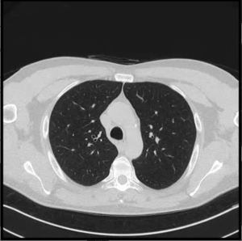
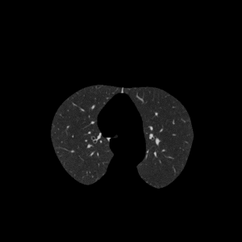
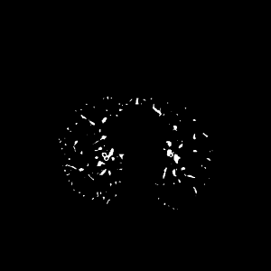

## Introduction

This project analyzes Computed Tomography lung studies exported as .mp4 videos using OpenCV in order to return the following results:

- Total pulmonar damage
- Overall damage score [*(see)*](https://www.elsevier.es/en-revista-radiologia-english-edition--419-articulo-radiologic-diagnosis-patients-with-covid-19-S2173510721000033#imagen-10)
- CO-RADS score [*(see)*](https://www.ncbi.nlm.nih.gov/pmc/articles/PMC7981938/)

This is accomplished by using a series of image processing operations over each frame of said study, among the most important tasks are:

- Isolation of pulmonar area

- Detection of tissue

The damage is approximated using a `countNonZero()` operation over the detected tissue map, and adjunsting for the average % of tissue that should be inside the lungs; this approach is fundamentally flawed as damage will be detected even in a healthy individual, as such, an overall damage of *<15%* could be considered as being effectively *0%*.

## Usage

### Setup
    git clone https://github.com/catneep/covyx
    cd covyx
    python3 -m venv venv    # python for Windows
    . venv/bin/activate     # venv/scripts/activate for Windows
    pip install -r requirements.txt

Or by using *make*:

    git clone https://github.com/catneep/covyx
    cd covyx
    make

### Analysis
Syntax:

    python3 . {path} --time --pretty

Where:
- **path**: The path to the .mp4 file to analyze
- **--time**: Add the analysis runtime to the results
- **--pretty**: Pretty print the results

Example:

    python3 . /path/to/file.mp4 --time

The output is generated as a JSON string, that may be saved to a file by using:

    python3 . /path/to/file.mp4 --time > /path/to/results.json
